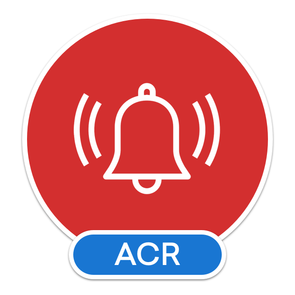

#  ACR Notifications Plugin for Xamarin and Windows
_The ULTIMATE Cross Platform Notification Plugin for Xamarin & Windows_

### [SUPPORT THIS PROJECT](https://github.com/aritchie/home)

[Change Log - October 27, 2018](changelog.md)

## DOCS & FEATURES

* [Basics](basics.md)
* [Querying](basics.md)
* Actions & Events - TODO
* [Cancel Specific or All](basics.md)
* [Sounds](sounds.md)
* [Additional Data on Notification](basics.md)
* [Android Specific](platform_android.md)
    * Survives Reboots
    * Channels, Colors
    * Priorities
    * Icon Control
    * Vibrate
* [Triggers](triggers.md)
    * [Time Interval Based](interval.md)
    * [Calendar Based - Specific Date, Day of Week, Week of Year](calendar.md)
    * [Geofence Location Based](geofencing.md)
* [Badges](bonus.md)
* [Vibrate Device (Android & iOS only)](bonus.md)
* [Frequently Asked Questions (FAQ)](faq.md)

Platform|Version
--------|-------
Android|5.0+
iOS|9+
Windows UWP|16299+
Any Other Platform|Must Support .NET Standard 2.0

### SETUP

Install the nuget package in your platform project as well as your netstandard library.

* [Android](platform_android.md)
* [iOS](platform_ios.md)
* [Windows](platform_uwp.md)

## CONTRIBUTORS

* **[Jelle Damen](https://twitter.com/JelleDamen)** for the wonderful icons